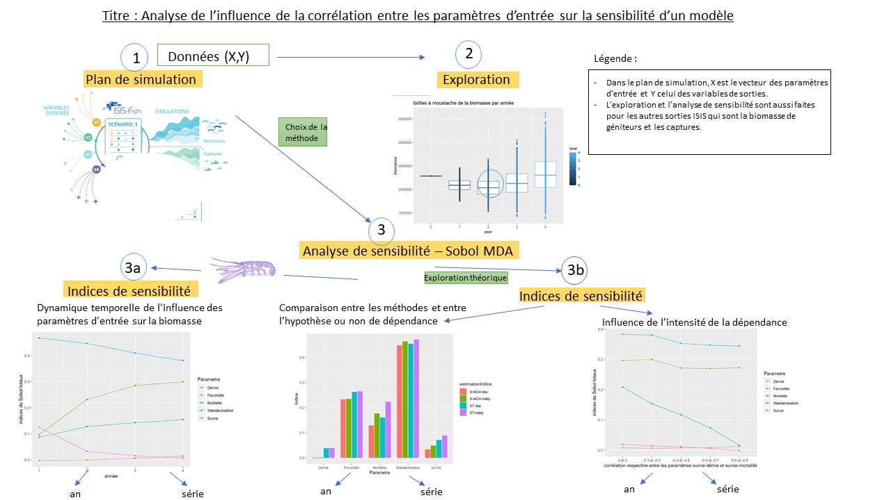

```{r setup, include=FALSE}
knitr::opts_chunk$set(echo = TRUE)
```

```{r, include = FALSE}
library(knitr)
library(magrittr)
library(dplyr)
library(ggplot2)
library(psych)
library(copula)

options(tinytex.verbose = TRUE)

cheminRData<- '../Rdata/'

```


# Résumé 

L’analyse de sensibilité est une méthode qui permet de quantifier l’influence des paramètres d’entrée sur les variables de sorties. Elle est très utilisée dans l’étude des modèles complexes car elle permet de cibler les incertitudes importantes à prendre en compte dans une évaluation de la robustesse des sorties du modèle. Elle permet aussi de classer les paramètres par ordre d’influence sur les sorties du modèle et ainsi faire du factor fixing, c’est-à-dire fixer les paramètres peu influents à leur valeur de référence.

La plupart des méthodes d’analyse de sensibilité utilisées repose sur une hypothèse d’indépendance entre les paramètres d’entrée, ce qui, on le sait, est rarement le cas dans les modèles. Nous avons donc étudié différentes méthodes d’analyse de sensibilité prenant en compte la dépendance entre les paramètres d’entrée (Shapley et Shapley HSIC (@da2021basics)) et nous avons choisi d’utiliser la  méthode Sobol-MDA (@benard2022mean). Cette méthode repose sur la construction d’un modèle statistique de forêt aléatoire et les indices de sensibilité sont calculés à partir de l’estimation de l’importance de chaque covariables (paramètres du modèle complexe).

Dans cette étude, nous avons étudié la sensibilité d’une pêcherie langoustinière modélisée avec ISIS-Fish. ISIS-Fish est un modèle de dynamique de pêcherie utilisé pour construire et évaluer des scénarios de gestion spatialisée des pêches.
Après avoir fait une hypothèse de dépendance sur 5 paramètres incertains d’ISIS-Fish, nous avons construit un plan d’expérience et réalisé les simulations de ce plan avec ISIS-Fish. Nous avons ensuite ajusté un modèle de forêt aléatoires à chaque variable de sortie du modèle (biomasse, biomasse de géniteurs et captures) et estimé les indices de Sobol totaux avec l’algorithme Sobol-MDA.  

Tout d’abord, en se basant sur le R² (le coefficient de corrélation partielle qui correspond au pouvoir descriptif ou explicatif), on note que les 3 modèle de forêt aléatoires s’ajustent bien. On remarque ensuite que le classement des paramètres par ordre d’influence change en fonction de la sortie étudiée. De plus, il évolue en fonction des années, par exemple, pour la biomasse, la fécondité est 4ème sur 5 la 1ère année (peu d’influence) mais elle est 2ème sur 5 la 4ème année (nettement plus influente). Ce qui peut s’expliquer par le fait que la première année de simulation est caractérisée par une très forte abondance de jeunes langoustines de l’année (recrutement) dont le poids augmente avec le temps. 

Pour évaluer l’erreur que l’on aurait pu faire en ne prenant pas en compte la dépendance entre les paramètres, nous avons aussi calculé les indices de sensibilité en supprimant la dépendance des paramètres d’entrée. Nous avons remarqué des différences dans les valeurs des indices. Néanmoins, dans la plupart des cas, cette différence n’est pas assez grande pour changer le classement par ordre d’influence des paramètres. On en déduit donc que l’on aurait eu des résultats assez similaires sans prendre en compte la dépendance. 

Finalement, nous avons voulu comprendre comment l’intensité de la dépendance influait sur l’analyse de sensibilité. Nous avons montré qu’une augmentation de la corrélation entre les paramètres peut changer le classement par ordre d’influence des paramètres. La valeur des indices de Sobol MDAdes paramètres corrélés diminue significativement lorsque la corrélation augmente. Comme le Sobol-MDA mesure l’augmentation de l’erreur du random forest lorsque l’un des paramètres est retiré du processus de prédiction, il est normal que l’indice de Sobol total d’un paramètre fortement corrélé à un autre diminue puisque l’information qu’il apportait est contenue dans un autre paramètre. Dans une configuration à forte corrélation, il faut néanmoins rester prudent si l’on souhaite faire du factor fixing. En effet, dans une analyse de sensibilité mêlant des paramètres indépendants et d’autres très corrélés, les indices de sensibilité des paramètres corrélés pourraient être classés peu influents relativement aux paramètres indépendants. On pourrait alors être tenté de fixer les paramètres dependants à leur valeur de référence et fausser l’analyse de la robustesse des variables de sortie du modèle.  


# Présentation de l'entreprise

> "De la côte au large, des abysses à la surface, l’Ifremer porte l’ambition de sciences océaniques belles, utiles et partagées." -
François Houllier, Ifremer | Président Directeur Général


L'Ifremer est le seul institut de recherche français entièrement dédié à l'océan. L'Ifremer mène des recherches, innove pour accélérer l'économie bleue et produit des expertises en appui aux politiques publiques pour protéger et restaurer l'océan, pour exploiter ses ressources de manière responsable et pour partager les données marines. L'Ifremer opère la flotte océanique française, la cinquième plus importante au monde. 

L'Ifremer emploie actuellement 1525 personnes et disposait de 260 millions d'euros de budget en 2022. Il possède 24 implantations en France et dans les Outre-mer. Il est implanté sur tous les océans : sur l'océan Pacifique (Vairao (Tahiti) et Nouméa (Nouvelle-Calédonie)), dans l'océan indien (la Réunion), en Méditérranée (La-Seyne-sur-Mer, Palavas-les-Flots,Sète), en Manche-Mer du Nord (Boulogne-sur-Mer, Port-en-Bessin, Saint-Pierre et Miquelon), en Atlantique (Nantes, Arcachon, La Tremblade, Anglet), en Bretagne (Plouzané, Dinard, Concarneau, Lorient, Argenton), en Antille et Guyane (Le Robert (La Martinique), Cayenne (Guyane)). Par ailleurs, l’Ifremer est un acteur majeur de la recherche en sciences et technologies marines sur la scène européenne et internationale. En effet, par la présence de ses experts scientifiques dans les comités spécialisés, l'Ifremer participe à l’élaboration des politiques et stratégies européennes. De plus, l’expertise de l’Ifremer dans la collecte, la gestion et l’analyse de données marines est reconnue internationalement, comme en témoigne son rôle dans les grands programmes des Nations-Unies consacrés à l’observation de l’océan (GOOS1 , Argo…), à la gestion des données océaniques (IODE) et aux efflorescences algales toxiques (HAB2 ).

Il faut aussi souligner que l'Ifremer travaille étroitement avec des entreprises pour les accompagner dans leurs projets de recherche et de développement. Il collabore par des programmes de recherche, le co-développement de solutions, le transfert d’innovations ou la création de startups. Les entreprises bénéficient ainsi du savoir-faire, de nos solutions technologiques et de l’accès aux moyens d’essais de l'Ifremer. Par exemple, avec des entreprises, l'Ifremer travaille sur les énergies marines, la pêche, les biotechnologies, les ressources minérales, etc. L'Ifremer a par exemple participé au développement d'une nageoire de baleine pour des bâteaux moins énergievores, au développement d'une digue portuaire qui produit de l'électricité, au développement de solutions de dermo-cosmétique à partir de micro-algues, etc. Depuis 2011, l'Ifremer a enregistré des recettes totalisant 100 millions d'euros grâce à ses collaborations avec des entreprises.

Je suis en stage à l'UMR (Unité Mixte de Recherche) Marbec de Sète, qui a quatre tutelles principales (IRD, Ifremer, Université de Montpellier, CNRS) et une tutelle secondaire (INRAE). Ma maître de stage est chercheuse à l'Ifremer et les post-doctorants avec qui je partage mon bureau sont employés par l'IRD. 


# Introduction

De nos jours, la diversification des usages en mer ne cesse de s'amplifier (éolien en mer, extraction de granulats, conchyliculture, etc.) et l'espace maritime fait plus que jamais l'objet de conflits sociaux, économiques et environnementaux.  Dans ce contexte, la gestion spatialisée des activités humaines proposée par la Commission Européenne (directive établissant un cadre pour la planification spatiale de l'espace maritime (@milieumarinfrance), directive cadre stratégie pour le milieu marin (@milieumarinfrance2), politique commune des pêches) prend tout son sens. Les outils de modélisation spacialisés deviennent dès lors une approche incontournable pour aider à la prise de décision en apportant de la connaissance sur les conséquences possibles de réglementations spatiales complémentaires des mesures actuelles (@mahevas2004isis). Pour appréhender une gestion écosystémique spatialisée des pêches, nous utilisons le modèle de simulation ISIS-Fish (isis-fish.org). Ce modèle spatialisé permet de décrire la dynamique spatio-temporelle des flottilles de pêche et son incidence sur les principales espèces capturées. Pour permettre le choix d’une règlementation parmi plusieurs il est indispensable d’évaluer la robustesse des sorties du modèle (@saltelli2004sensitivity). 

Toutes les incertitudes en entrée du modèle n’influent pas dans les mêmes ordres de grandeur sur les sorties du modèle. L’analyse de sensibilité est une méthode qui permet de quantifier l’influence des paramètres d'entrée sur les variables de sorties (@faivre2013analyse). En plus de permettre de cibler les incertitudes importantes à prendre en compte dans une évaluation de la robustesse des sorties du modèle, l'analyse de sensibilité permet de trouver les covariables les plus influentes dans le but de : (i) trouver un petit nombre de covariables maximisant la précision ou (ii) classer les covariables par ordre d'influence pour l'interprédation du mécanisme de prédiction du modèle (@genuer2010variable). Les stratégies adoptées varient selon l'objectif suivi. Par exemple, si deux variables influentes sont fortement corrélées, l'une sera écartée dans le cas (i) tandis que les deux seront gardées dans le cas (ii). Des méthodes d'analyse de sensibilité supposant l'indépendance entre les entrées ont d'abord été développées (@faivre2013analyse, @saltelli2004sensitivity). Puis, comme dans de nombreuses applications il est courant que les variables d'entrée aient une structure de dépendance statistique (connue ou supposée), la recherche s'est alors portée sur des méthodes plus complexes prenant en compte la dépendance entre les entrées (@da2021basics). 


Les indices de Sobol (@da2021basics) font partie des méthodes d'analyse de sensibilité qui ne prennent pas en compte la dépendance entre les paramètres d'entrée. Cette méthode permet, grâce une décomposition exacte de la variance, de calculer des indices de sensibilité dans le cadre d'entrées indépendantes (voir annexe). Les effets de Shapley (@da2021basics), initialement formulés pour mesurer la contribution au jeu de chaque joueur, dans le cadre de la théorie des jeux coopératifs, prennent en compte la dépendance entre les paramètres d'entrée dans le calcul des indices. Ils résultent, dans le cas de l'analyse de sensibilité, d'une allocation directe d'une part de la variance de la sortie à chaque entrée (voir annexe). Cette méthode est très intéressante dans le sens où elle prend en compte la corrélation entre les entrées et qu'elle repose sur une formule exacte faisant intervenir les indices de Sobol. Néanmoins, l'estimation des indices de Shapley peut s'avérer compliquée en grande dimension car elle nécessite de considérer toutes les permutations possibles des variables d'entrée. Par ailleurs, pour remédier au fait que dans certains cas la variance ne représente pas très fidèlement la variabilité de la distribution de la sortie, des mesures d'importance du moment indépendant ont été introduites. Ces mesures visent à comparer la loi de probabilité de la sortie (notée Y) avec celles des différentes entrées (notées X) pour voir à quel point celles-ci se ressemblent. Parmi ces mesures, on peut citer l'indice de Shapley-HSIC (@da2021kernel), formulé en utilisant les indices Hsic  qui calculent la dépendance entre deux variables Y et X comme la distance entre leur distribution jointe et le produit de leurs distributions marginales (voir annexe). Nous nous sommes finalement intéressées à une dernière méthode utilisant un algorithme d'apprentissage automatique qui repose sur la construction d'une forêt aléatoire (random forest en anglais), pour construire un méta-modèle et ensuite estimer les indices de sensibilité de ce méta-modèle.

Les random forests sont des algorithmes d'apprentissage statistique capables de résoudre des problèmes de régression et de classification (@breiman2001random). Ils peuvent s'appliquer à des données de grande dimension et aux sorties multivariées. Pour permettre l'interprétation des random forests, l'analyse d'importance des variables est principalement utilisée. Les covariables en entrée (X) sont alors classées par ordre décroissant de leur importance dans le processus de prédiction de l'algorithme. L'algortihme Sobol-MDA (@benard2022mean), basé sur ranger, une implémentation rapide de random forest (@wright2015ranger), permet la mesure d'importance des covariables dans le cadre dépendant. De plus il a été prouvé  que cet algorithme converge vers l'indice de Sobol total et des experimentations sur des fonctions théoriques ont montré que le classement des variables par ordre d'importance obtenu avec cet algortihme est le même que celui obtenu avec les calcul théorique des indices de Sobol totaux (voir @benard2022mean).

Construire un métamodèle permet de prédire les sorties Y du modèle pour tout entrée X du domaine de définition beaucoup plus simplement et rapidement (@faivre2013analyse). On peut ainsi obtenir des prédictions sur un échantillon d'entrée de grande taille, et utiliser ces données pour évaluer et analyser la relation entre les différentes covariables d'entrée (X) et les sorties (Y) du métamodèle. Il faut néanmoins rester prudent car les indices obtenus sont les indices de sensibilité du métamodèle et non du modèle initial. Néanmoins, plus \(R^2\), le coefficient de corrélation partielle qui correspond au pouvoir descriptif ou explicatif d'un métamodèle, est proche de 1, plus la valeur des indices du métamodèle est proche de la valeur des indices du modèle initial. 

Dans le cadre de cette étude, nous avons tout d’abord exploré les sorties du modèle pour comprendre
leur dynamique. Puis, à partir des données des simulations de notre modèle, nous avons construit des métamodèles random forests d'une pêcherie langoustinière paramétrée avec ISIS-Fish (voir @mimi1 et @mimi). Ces métamodèles prennent en entrée 5 paramètres.  Après avoir vérifié que ces métamodèles ajustaient bien notre modèle, nous les avons utilisé pour l'analyse de sensibilité. Dans un premier temps, nous avons observer, année par année, le classement par influence des paramètres d'entrée du modèle puis nous avons regardé la dynamique temporelle des indices de sensibilité. Cela nous a permis d'évaluer les paramètres les plus influents, ce qui est très utlile si l'on souhaite faire du factor fixing par exemple, c’est-à-dire choisir les entrées à fixer. Dans un deuxième temps, en ayant en tête un objectif plus théorique cette fois, nous avons comparer les valeurs des indices dans le cas de paramètres dépendants et indépendants
ainsi que les valeurs des indices obtenues selon les différentes méthodes de calcul. De plus, nous avons cherché à voir de quelle manière la corrélation entre les paramètres d'entrée fait varier la valeur des indices de sensibilité.

La section 2 est consacrée à la présentation des méthodes utilisées, c'est-à-dire le random forest, les indices de Sobol totaux et la mesure d'importance Sobol-MDA. Nous présentons aussi la démarche suivie, avec tout d'abord la réalisation de simulation avec ISIS-Fish, puis la construction des random forests et finalement l'exploration des résultats et l'analyse de sensibilité. La section 3 présente plus en détails les données de cette étude. On s'intéresse d'abord au modèle étudié ISIS-Fish et ensuite à la pêcherie langoustinière paramétrée avec ISIS-Fish et inspirée de la  pêcherie de la grande vasière dans le golfe de Gascogne (voir @mimi1 et @mimi). Une sous partie est consacrée aux paramètres d'entrée incertains de cette pêcherie dont on étudie l'influence sur les sorties. Finalement, la section 4, consacrée aux résultats, s'intéresse préalablement à la dynamique temporelle des sorties du modèle, à la propagation des incertitudes en entrée sur les sorties ainsi qu'aux variations des sorties en fonction d'un seul paramètres qui varie. Ensuite, après avoir construit les random forests et vérifié leur pouvoir prédictif, nous regardons les indices de Sobol-MDA année par année et leur dynamique temporelle. Nous comparons la valeur des indices selon la manière dont ils ont été calculé et selon la dépendance ou non entre les paramètres. Pour terminer, nous regardons comment l’intensité de la dépendance influe sur l’analyse de sensibilité.




\newpage


# Méthode


Dans cette partie nous présentons les randoms forests, la mesure d'importance Sobol-MDA ainsi que la démarche mise en oeuvre.


## Méthodes utilisées

Les random forests sont des algorithmes qui, après avoir été entraînés sur des données d'entraînement, sont capables de prédire une valeur de sortie y pour n'importe quelle valeur d'entrée. Les random forests sont constitués d'arbres de régression si Y est continue ou de classification si Y est catégorielle, ils sont présentés dans @breiman2017classification. Dans notre cas, le random forest sera composé d'arbres de régression car la sortie Y de notre modèle est continue. Nous nous baserons sur le livre de @breiman2017classification pour expliquer en détails la construction de ces arbres puis nous nous baserons sur les articles de @breiman2001random et de @scornet2023trees pour comprendre la construction d'une forêt aléatoire et l'estimation de son erreur généralisée. Ensuite nous présenterons ranger (détaillé dans @wright2015ranger), une implémentation rapide et adaptée aux grandes dimensions de random forest utlisée dans Sobol-MDA (@benard2022mean) pour la construction du random forest. Finalement, nous détaillerons la manière dont Sobol-MDA calcule les mesures d'importance de chaque covariables ainsi que les hypothèses et résultats de convergence de cet algorithme.

### Arbres de régression

Les CART (Classification And Regression Tree décrit dans @breiman2017classification ) sont les composants élémentaires d'une forêt aléatoire. Nous allons voir dans la suite comment se déroule leur construction. L'algorithme de construction effectue un partitionnement récursif des données, puis estime un modèle très simple dans chaque élément de la partition. Un élément de la partition est appelé feuille de l'arbre. En résumé, le but est de choisir "intelligemment" une caractéristique puis de couper astucieusement les données selon cette caractéristique de sorte que la prévision \(y_i\) soit la moyenne des observations dans la feuille. On recommence ensuite ce processus sur les sous-arbres obtenus jusqu'à notre critère d'arrêt. Voyons cela en détails.


On considère qu'on a n individus et on note \(X_i\) le vecteur des p covariables d'entrée, on a alors \(X_{i,k}\) avec \(i \in \{1,...,n\}\) et \(k \in \{1,...,p\}\). On note \(Y_i\) la variable de sortie à prédire associée au vecteur d'entrée \(X_i\). L'objectif est de découper l'espace en J régions \(R_1,..., R_j\) (les feuilles de l'arbre) qui minimisent : 
\[RSS=\sum_{j=1}^{J}{\sum_{i\in R_j}{}}{(y_{i}-\hat{y_j})^2}\]

où \(\hat{y_j}\) est la moyenne des sorties obtenues avec les entrées situées dans la région \(R_j\) c'est à dire \(\hat{y_j}=\frac{1}{n_j}\sum_{i\in R_j}y_i\) avec \(n_j\) le nombre d'observations dans la feuilles \(R_j\). Dans le CART de base on suppose que \(\hat{y_j}=a\) où a est une constante mais il existe des variantes de type \(\hat{y_j}=x \beta\).

Pour faire cela, à chaque noeud il faut choisir une variable (i.e une composante du vecteur X ) selon laquelle on divise les données. On considère les zones \(R_{-}(k,s)=\{x_i \text{ tel que }x_{i,k}<s\}\) et \(R_{+}(k,s)=\{x_i\text{ tel que }x_{i,k}\geq s\}\). A chaque étape, CART choisit la variable j et le seuil s (on a (k,s) \(\in C\) l'ensemble des coupes possibles dans les données d'un noeud) minimisant la variance intra-groupe définie comme suit : \[VI=\frac{1}{n_{noeud}}\sum_{i \text{ tel que } X_i \in R_{-}(j,s)}(y_i-\hat{y}_{R_{-}})^2+\frac{1}{n_{noeud}}\sum_{i \text{ tel que } X_i\in R_{+}(j,s)}(y_i-\hat{y}_{R_{+}})^2\]
où \(n_{noeud}\) est le nombre de données dans le noeud que l'on cherche à diviser (pour le noeud initial de l'arbre on a donc \(n_{noeud}=n\)).
Minimiser la somme des carrée des résidus revient donc à minimiser \[RSS=\sum_{j=1}^{J}n_jVj\] où \(V_j=\frac{1}{n_j}\sum_{i\in R_j}(y_i-\hat{y_j})^2\) est la variance intra-groupe et \(n_j\) le nombre d'observations dans chaque feuille de l'arbre.

Dans l'algorithme random forest que nous utilisons, à chaque noeud de l'arbre, on recherche quelle est la meilleure division non sur toutes les covariables possibles mais sur un échantillon de m covariables tirées aléatoirement et sans remplacement. La meilleure division est sélectionnée uniquement parmi ce m covariables (ce qui présente un gain de temps considérable pour les problèmes de grandes dimensions). Par défaut, on prend \(m=\frac{p}{3}\) en régression mais on peut aussi prendre \(m=\sqrt{p}\) dans les cas de très grandes dimensions.

Concernant l'arrêt de l'algorithme de construction, deux critères sont principalement utilisés :

- un nombre d'observations q suffisamment petit dans les feuilles

- un critère d'erreur (ici la variance inter-groupe) inférieur à un seuil \(\delta\)

On peut choisir d'arrêter la récursion lorsque les deux critères sont vérifiés ou seulement lorsque l'un des deux est vérifié.

### Construction d'une forêt aléatoire 

Une forêt aléatoire n'est rien d'autre qu'un ensemble d'arbres de décision (dans notre cas d'arbres de régression). Ainsi, avant la construction de chaque arbre k on tire un échantillon aléatoire bootstrap \(D_k\) de taille n dans l'échantillon intial D de taille n lui aussi, c'est-à-dire que l'on tire aléatoirement, uniformément et avec remise n vecteurs \(x_i\) dans D. Cet échantillon \(D_k\) servira alors de données d'entraînement pour l'arbre k. Les vecteurs \(x_i\) qui n'ont pas été tirés (il y en a sûrement grâce au tirage avec remise) sont gardés de côté et constituent l'échantillon Out Of Bag de cet arbre.
La prédiction par la forêt aléatoire est alors la moyenne des prédictions de chaque arbre de la forêt.

### Calcul de l'erreur généralisée d'une forêt

Lorsque l'on construit une forêt aléatoire il est essentiel de savoir à quel point les prédictions qu'elle réalise sont précises. Pour cela il est possible d'estimer son erreur généralisée, ce qui revient en pratique à calculer le carré de la différence entre les valeurs de sortie des échatillons OOB et les valeurs de sortie des échantillons OOB prédites par la forêt et de moyenner le tout. Pour faire cela, l'algorithme suivant (présenté dans @cutler2012random et ) peut être utlisé  :

Soit $D_k$ le k-ème échantillon bootstrap et $\hat{h}_j(x)$ la prédiction de $x$ à partir du j-ème arbre, pour $j = 1, . . . , J$. Pour $i = 1$ à $n$ : 

1. Soit $J_i = \{ j : (x_i, y_i) \notin D_j\}$ et $|J_i|$ le cardinal de $J_i$. 

2. Définissons la prédiction hors sac à $x_i$ comme suit :

   - $\hat{f}_{oob}(x_i) = \frac{1}{|J_i|} \sum_{j \in J_i} \hat{h}_j(x_i)$ pour la régression
   
   
L'erreur de généralisation est généralement estimée en utilisant l'erreur quadratique moyenne (MSE) hors sac suivante :

\[
\text{MSE}_{oob} = \frac{1}{n} \sum_{i=1}^{n} (y_i - \hat{f}_{oob}(x_i))^2
\]

En résumé, pour chaque vecteur \(x_i\) de l'ensemble d'entraînement initial D, on calcule sa prédiction par chacun des arbres k dont il n'a pas fait partie de l'ensemble d'entraînement \(D_k\) et on moyenne ces prédictions pour avoir sa prédiction "par la forêt" (même si dans ce cas on ne l'a pas fait passer par tous les arbres). Ensuite, pour obtenir l'estimation généralisée de la forêt on fait la moyenne des différences au carré de la prévision de chaque \(x_i\) et de sa valeur de sortie présente dans l'échantillon d'entraînement D.

### Mesure d'importance des variables grâce à l'algorithme Sobol-MDA

Un des problèmes majeurs des random forests réside dans le fait que leurs propriétés mathématiques restent toujours un peu "magiques", ce qui rend leur interprétabilité plus compliquée. Les personnes désireuses de se pencher d'avantage sur les forces à l'oeuvre derrière le processus de prédiction se sont alors principalement tournées vers l'importance des variables, une mesure de l'influence de chaque variable d'entrée dans la prédiction de la sortie. Dans l'article initial de @breiman2001random sur les random forests, deux mesures d'importance sont présentées : la diminution moyenne de l'impureté (MDI, ou Gini importance, voir @breimanManual2002 ) qui somme les diminutions pondérées de l’impureté sur tous les
noeuds qui se divisent selon une covariable donnée, et la diminution moyenne de la précision (MDA, voir @breiman2001random) qui permuttent les valeurs d'entrée d'une certaine variable dans les données du test et calcule la différence entre l'erreur sur l'ensemble test permutté et l'ensemble test original. L'un des grands avantages du MDI et du MDA réside dans leur capacité à prendre en compte l'intéraction entre les covariables mais d'un autre côté ils sont incapables de déterminer la partie de l'effet marginal d'une covariable donnée ((voir @wright2016little). Par ailleurs, MDA et MDI présentent tous les deux des biais non négligeables dans le cas de variables corrélés. Une version modifiée du MDA, nommée Sobol-MDA et expliquée dans @benard2022mean, a ainsi été développée pour être capable de donner des résultats pertinents même dans des cas de corrélations entre les variables. Nous avons donc choisi d'utiliser Sobol-MDA pour évaluer la sensibilité de notre modèle.

Après avoir brièvement expliqué le fonctionnement du MDA, nous nous intéressons plus en détails à l'algorithme Sobol-MDA et nous verrons certains résultats de convergence de celui-ci. 

#### Présentation et limites du MDA 

Le MDA, mesure de la diminution de la précision en français, a été initialement introduit pas Breiman dans son article @breiman2001random. Il repose sur le fonctionnement suivant : les valeurs d'une covariable spécifique sont permutées pour casser sa relation avec la variable de sortie. La précision prédictive est alors calculée pour cet ensemble de donées permutées. La différence entre la précision de l'ensemble dégradé et la précision de l'ensemble intial est alors calculée, cette différence donne la mesure d'importance de la covariable pour laquelle on a permuté les valeurs. Une grande diminution de la précision signifie que la variable considérée a une grande influence dans le mécanisme de prédiction. Bien que cette mesure soit très utilisée en pratique, on ne sait que très peu de choses sur ces propriétés statistiques. Sa convergence vers les indices de Sobol totaux n'a pas pu être prouvée et de nombreuses études empiriques ont montré que, lorsque les covariables sont dépendantes, le MDA ne détecte pas certaines variables influentes. Pour tenter d'y remédier, @williamson2023general proposent de mesurer la diminution de la précision entre la forêt originale et une forêt entraînée sans l'une des covariables. Néanmoins, comme il faut réentraîner la forêt et calculer sa précision autant de fois qu'il y a de covariables, cette méthode a un coût de calcul très élevé et n'est pas adaptée aux grandes dimensions.

#### Sobol-MDA 


La mesure d'importance Sobol-MDA propose de mimer l'entraînement d'une forêt sans l'une des covariables sans avoir besoin de réentraîner une forêt. Expliquons cela plus clairement. 

Le Sobol-MDA (@benard2022mean), une amélioration de la méthode  MDA, a été introduit pour estimer les indices de Sobol totaux même lorsque les covariables (X) sont dépendantes. Cette méthode vise à estimer les indices de Sobol totaux. Les indices de Sobol totaux correspondent à la proportion de la variance expliquée de la réponse perdue lorsqu'une des covariables est retirée du modèle (voir l'annexe sur les indices de Sobol pour plus de détails). L’indice de sensibilité total de l’entrée \(X_i\) est défini
comme la somme des indices associés à l’effet principal de \(X_i\) et à toutes
les interactions entre \(X_i\) et d’autres entrées (voir figure 2). 


Pour le dire d'une troisième façon, la sensibilité totale mesure donc la variance
moyenne (normalisée) de Y quand toutes les entrées sauf \(X_i\) sont fixées. Lorsque l'on souhaite effectuer un factor fixing, c’est-à-dire choisir les entrées à fixer, on utilise principalement les indices totaux. Les indices
de sensibilité totaux très faibles correspondent en effet aux entrées
que l’on peut fixer arbitrairement sans modifier sensiblement le comportement du modèle. 


#### algorithme

Pour retirer une variable j du processus de prédiction de
l’arbre on procède comme suit. La partition de l’espace de
covariables obtenue avec les feuilles terminales de l’arbre
d’origine est projetée selon la j-ième direction et les sorties des
cellules de cette nouvelle partition projetée sont recalculées
avec les données d’entraînement. Ce procédé permet de retirer
la variable j du processus de prédiction de l’arbre. Ensuite, il est possible
de calculer la précision de l’estimation de la forêt projetée
grâce aux échantillons OOB, de soustraire cette précision de
la précision initiale et de normaliser la différence obtenue par
\(V [Y ]\) pour obtenir le Sobol-MDA pour \(X_j\). 

En pratique, les données d’entraînement et les échantillons OOB de l'arbre sont mis dans
l’arbre et envoyés à droite et à gauche du noeud si celui-ci fait une
division sur la covariable j. A la fin, chaque donnée peut donc se
retrouver dans plusieurs feuille terminales. Pour chaque donnée
OOB, la prédiction associée est donc la moyenne des sorties des
données d’entraînement qui sont tombées sur les mêmes feuilles
terminales que la donnée OOB. En d'autres termes on calcule l'intersection entre les feuilles terminales où est tombée la donnée OOB et les feuilles terminales où sont tombées les données d'entraînement. Cette intersection donne la cellule
projetée. Ce mécanisme est équivalent à projeter la partition de
l’arbre sur le sous-espace engendré par \(X^{(-j)}\).

Ecrivons cela plus formellement. 

On note \(\Theta\) le vecteur qui contient les indices des vecteurs de l'échantillon initial utilisé pour l'entraînement de l'arbre auquel il est associé
et on note \(m_n(x,\Theta)\) l'estimation de la valeur de la sortie de x par un arbre entraîner avec un échantillon indiqué par \(\Theta\) , Sobol-MDA prédit donc \(m^{(-j)}(X^{(-j)})=E[m(X)|X^{(-j)}]\).

On note \(A_n(X,\Theta)\) la cellule de la partition de l'arbre d'origine où X tombe et on note \(A_n^{(-j)}(X^{(-j)},\Theta)\) la cellule associé de la partition projetée. On note l'estimation par l'arbre projeté associé \(m_n^{(-j)}(X^{(-j)},\Theta)\) et l'estimation par la forêt projeté associée \(m_{M,n}^{(-j,OOB)}(X_i^{(-j)},\Theta_{(M)})\). Ces estimations sont définies de la manière suivante :

\[m_n^{(-j)}(X^{(-j)},\Theta)=\frac{\sum_{i=1}^{a_n} Y_i 1_{X_i \in A_n^{(-j)}(X^{(-j)},\Theta)}}{\sum_{i=1}^{a_n} 1_{X_i \in A_n^{(-j)}(X^{(-j)},\Theta)}}\]
\[m_{M,n}^{(-j,OOB)}(X_i^{(-j)},\Theta_{(M)})=\frac{1}{|\Lambda_{n,i}|} \sum_{l \in \Lambda_{n,i}} m^{(-j)}_{n}(X^{(-j)}_i, \Theta_l)1_{|\Lambda_{n,i}|>0}
\]

 L'indice de Sobol-MDA est donné par la différence normalisée de l'erreur carrée (calculée grâce aux OOB) de la forêt projetée et l'erreur carrée (calculée grâce aux OOB) de la forêt initial, Sobol-MDA est donc défini de la manière suivante :
 
 \[\widehat{S-MDA}_{M,n}(X^{(j)})=\frac{1}{\hat{\sigma}^2_Y}\frac{1}{n}\sum^{n}_{i=1}\{Y_i-m_{M,n}^{(-j,OOB)}(X_i^{(-j)},\Theta_{(M)})\}^2\]
 \[-\{Y_i-m_{M,n}^{(OOB)}(X_i,\Theta_{(M)})\}^2\]
où \(\hat{\sigma}^2_Y=\frac{1}{n-1}\sum^{n}_{i=1}(Y_i-\bar{Y})^2\) est la variance standard estimée de la réponse Y.

#### convergence

Dans l'article @benard2022mean, , sous certaines hypothèses sur la construction du random-forest faciles à mettre en place, la convergence des indices Sobol-MDA vers les indices de Sobol totaux lorsque le nombre d'échantillons augmente a été prouvé. Nous présentons ici l'idée générale de la preuve.

L'indice de Sobol total \(S_j^T=\frac{E[Var(G(X)|X^{(-j)})]}{VarG(X)}\), s'écrit, dans le cas du random forest, en remplaçant G(X) par l'estimation obtenue par la forêt, l'indice de Sobol total s'écrit donc \(S_j^T=\frac{E[Var(m(X)|X^{(-j)})]}{Var[m(X)]}=\frac{E[(m(X)-E[m(X)|X^{(-j)}])^2]}{Var(m(X))}\). On cherche donc à montrer que 
\[\widehat{S-MDA}_{M,n}(X^{j})\overset{p}{\longrightarrow}S_j^T\]

Pour cela, on majore \(E[\widehat{S-MDA}_{M,n}(X^{j})\sigma_Y^2-E[(m(X)-E[m(X)|X^{(-j)}])^2]]\) par une expression dépendant de n en faisant une décomposition sur laquelle on applique l'inégalité triangulaire. On obtient alors 
\[\widehat{S-MDA}_{M,n}(X^{j})\sigma_Y^2\overset{p}{\longrightarrow}E[(m(X)-E[m(X)|X^{(-j)}])^2]\]

Ensuite l'indice de Sobol-MDA est normalisé par la variance standard estimée \(\sigma_Y^2\) de la sortie Y qui est convergente par la loi des grands nombres. Grâce au "mapping theorem" on a \[\frac{1}{\hat\sigma_Y^2}\overset{p}{\longrightarrow}\frac{1}{V[Y]}\] Sobol-MDA est donc le produit de deux quantités aléatoires qui converge en probabilité donc on obtient bien \[\widehat{S-MDA}_{M,n}(X^{j})\overset{p}{\longrightarrow}\frac{E[(m(X)-E[m(X)|X^{(-j)}])^2]}{V[Y]}=S_j^T\]


#### avantages

L'approche de @williamson2023general, consitant à réentraîner une forêt sans l'une des covariables, permet elle aussi d'approximer les indices de Sobol totaux. Néanmoins, l'avantage de l'approche Sobol-MDA est qu'elle nécessite seulement de faire des prédiction supplémentaires avec la forêt, ce qui est plus rapide que le réentraînement d'une forêt. L'algorithme de @williamson2023general a une complexité en \(O\{Mp^2nlog^2(n)\}\) qui est quadratique avec les dimensions et l'algorithme Sobol-MDA a une complexité en \(O\{Mnlog^3(n)\}\) ce qui est un grand avantage lorsque l'on travaille avec un grand nombre de varaibles d'entrée.


Concernant l'analyse des résultats, nous avons tout d'abord exploré les sorties du modèles pour comprendre leur dynamique. Nous avons étudié la dynamique temporelle des sorties, la propagation de l'incertitude d'entrée sur les sorties ainsi que la variabilité des sorties lorsqu'un seul des paramètres varie et que les autres sont fixés.
Nous avons ensuite pu construit 2 métamodèles random forests en utilisant ranger (@wright2015ranger), l'un lorsque les paramètres sont dépendants et l'autre losrque les paramètres sont indépendants. Nous avons ensuite estimé les indices de Sobol totaux sur les randoms forests en utilisant la méthode "Sobol-MDA". D'une part nous avons pu voir les paramètres qui inluent le plus sur les sorties et d'autre part nous avons pu comparer les valeurs des indices pour les paramètres dépendants et indépendants ainsi que les valeurs des indices obtenues selon les différentes méthodes de calcul (Sobol-MDA ou méthode classique du package sensitivity). Finalement, pour comprendre comment l’intensité de la dépendance influe sur l’analyse de sensibilité, nous avons construit des random forests avec des jeux de données dont les paramètres étaient de plus en plus corrélés. Nous avons calculé les indices de Sobol-MDA sur ces random forest et tracer l'évolution des valeurs des indices en fonction de la corrélation entre les paramètres d'entrée.

## Démarche mise en oeuvre

Pour réaliser cette étude, nous construisons plusieurs fichiers csv contenant les combinaisons des valeurs des paramètres d'entrée, et plus précisément un fichier avec des paramètres d'entrée suivant une distribution avec une hypothèse d'indépendance, d'autres avec différentes hypothèses de dépendance, et d'autres avec un paramètre fixe et 4 qui varient. Pour chaque fichier nous avons faits des simulations avec ISIS pour chacunes des combinaisons de paramètres d'entrée. Nous avons ensuite construits plusieurs fichiers rds contenant les valeurs des paramètres associés aux valeurs des sorties du modèle ISIS.


Concernant l'analyse des résultats, nous avons tout d'abord exploré les sorties du modèles pour comprendre leur dynamique. Nous avons étudié la dynamique temporelle des sorties, la propagation de l'incertitude d'entrée sur les sorties ainsi que la variabilité des sorties lorsqu'un seul des paramètres varie et que les autres sont fixés.
Pour chaque export du modèle (biomasse, biomasse de géniteurs et captures de pêche), nous avons ensuite construit 2 métamodèles random forests en utilisant ranger (@wright2015ranger), l'un lorsque les paramètres sont dépendants et l'autre lorsque les paramètres sont indépendants.  Nous avons ensuite estimé les indices de Sobol totaux sur les randoms forests en utilisant la méthode "Sobol-MDA". D'une part nous avons pu voir les paramètres qui inluent le plus sur les sorties et d'autre part nous avons pu comparer les valeurs des indices pour les paramètres dépendants et indépendants ainsi que les valeurs des indices obtenues selon les différentes méthodes de calcul (Sobol-MDA ou méthode classique shapleysobol_knn() du package sensitivity). Finalement, pour comprendre comment l’intensité de la dépendance influe sur l’analyse de sensibilité, nous avons construit des random forests avec des jeux de données dont les paramètres étaient de plus en plus corrélés. Nous avons calculé les indices de Sobol-MDA sur ces random forest et tracer l'évolution des valeurs des indices en fonction de la corrélation entre les paramètres d'entrée.

# Données

L'un des objectifs de cette étude étant d'évaluer la sensibité des sorties du modèle ISIS-Fish à certains paramètres d'entrée, nous allons dans ce chapitre présenter plus en détails le simulateur ISIS-Fish (voire @mahevas2004isis). Ensuite nous nous intéressons à la pêcherie langoustinière et aux paramètres d'entrée que nous allons faire varier pour évaluer la sensibilité. Finalement nous expliquerons le plan de simulations mis en place.

## Présentation d'ISIS-Fish

ISIS-Fish (Integration of Spatial Information and Simulation for Fisheries) est un simulateur des dynamiques de pêche. Il peut aider les pêcheurs, les managers, les entreprises et les scientifiques dans leur recherche de la meilleure gestion écosystémique spatialisée des pêches. Mais comment marche ce modèle mécanistique ? Tout d'abord, il faut avoir en tête que ce modèle est composé de trois sous-modèles qui intéragissent à travers le temps et l'espace. Précisons que le pas de temps est le mois et qu'un maillage de l'espace est réalisé pour obtenir des zones. Parmi les sous-modèles on trouve la modélisation du management, de l'activité de pêche et des dynamiques des populations de poissons. Leurs intéarctions sont représentées dans la Figure 3. 


La composante "management" simule les règles qui s'appliquent sur la pêche (mesures de sélectivité, TCA, zones protégées, saisons interdites, etc). La composante "populations de poissons" simule le cycle de vie des poissons. Chaque mois les poissons grandissent, migrent, se reproduisent, et certains meurent de causes naturelles (voire Figure 4). Pour chaque mois, une carte de l'abondance des poissons par zone est produite par ISIS.


La composante "dynamique des pêches" simule l'exploitation des ressources halieutiques. Celle-ci est quantifiée par l'effort de pêche, qui dépend des engins de pêche utilisés et de la durée passée à pêcher. Les navires de pêche ne sont pas représentés individuellement mais ils sont organisés en flottes rattachées à des zones de pêche selon la durée passée en mer et selon leurs caractéristiaues techniques. Pour chaque flotte, des stratégies décrivent la distribution de l'effort de pêche en fonction des métiers et des mois. Les statégies peuvent changer en fonction des mesures de management, de l'abondance des populations, du prix de l'essence et du prix de vente des poissons. Chaque mois, la carte (toujours à l'échelle des zones) de l'effort de pêche est alors mise à jour. 

A la fin de chaque mois, ISIS-Fish superpose la carte de l'effort de pêche sur celle de l'abondance des populations. Pour les espèces que l'on considère "immobiles", les captures par la flotte sont alors calculées sur les zones d'intersection (car on a donc sur ces zones des poissons et des pêcheurs). Pour les espèces qui se déplacent, les captures ne sont pas seulement calculées sur le nombre d'animaux marins présents dans la zone d'intersection mais aussi sur ceux des zones adjacentes qui passeront probablement par les zones d'intersection durant la durée de la pêche. En fonction des stratégies mises en place et de la réglementation, les pêcheurs décident des poissons à garder et de ceux à remettre à l'eau, on représente cela dans le modèle avec la probabilité de survie après relâchement.

Avant d'utiliser ISIS-Fish comme un outil d'aide à la prise de décision, les valeurs des paramètres doivent être sélectionnées pour représenter au mieux la pêcherie étudiée.  Pour cela, des données de pêche et des données d'études sont utilisées et des hypothèses sont faites dans le cas d'informations manquantes. Pour valider ou invalider les paramètres, on compare les résultats du simulateur avec les données sur la situation passée de la pêcherie étudiée.

Après validation des paramètres on peut simuler différents scénarios de management pour voir lequel conviendrait le mieux. Par exemple, on peut estimer le poids des captures de pêche dans 5 ans dans le cadre de mise en place d'une zone de pêche protégée. Des simulations sont alors faites avec des valeurs de paramètres prises aléatoirement dans leur intervalle de confiance. On obtient alors non pas une valeur de sortie mais un intervalle de valeurs de sortie. On prend ainsi en compte la propagation de l'incertitude d'entrée dans la sortie. Un des objectif est de réduire les incertitudes en entrée pour ainsi réduire l'incertitude en sortie. L'analyse d'incertitude est très utiles dans le sens où, en nous fournissant les paramètres d'entrée qui augmente le plus la variance de la sortie, elle nous permet de connaître les paramètres pour lesquels on doit chercher en prorité à réduire l'incertitude.

## Précisions sur la pêcherie langoustinère

La pêcherie langoustinière étudiée ici est inspirée de la pêcherie de la grande
vasière dans le golfe de Gascogne paramétrée avec ISIS-Fish. La paramétrisation a été simplifiée pour faciliter l'utilisation et la compréhension de ce modèle.

Le cycle de vie de la langoustine est décrit dans le modèle au travers de 10 classes d’âge qui se distribuent
spatialement sur 9 rectangles de taille 1 degré en longitude et 0.5 degré en latitude. Chaque classe d’âge se
caractérise par une largeur moyenne de la carapace de la tête (longueur céphalothoracique) qui permet de
décrire l’interdiction de débarquer des langoustines dont la carapace de la tête est plus petite que 20 mm
(réglementation de la taille minimale de débarquement). Si une langoustine trop petite est capturée, elle est
rejetée dans la mer avec une chance de survie (proportion de survie). Le renouvellement annuel des langous-
tines juvéniles est dépendant de la quantité de langoustines en âge de se reproduire (relation stock-recrute-
ment de Beverton et Holt). Dans cette description, on fait l’hypothèse qu’il n’y a pas de dispersion des larves
à l’extérieur des 9 rectangles ni entre les rectangles. A chaque mois de l’année, le modèle décrit la carte du
nombre de langoustines par classe d’âge (abondance ou biomasse en poids).
Les langoustines sont capturées par plusieurs groupes de bateaux de pêche (chalutiers) qui diffèrent par leur
port d’attache, leur longueur, les espèces ciblées (métiers : langoustiniers, poissons benthiques, poissons
démersaux) et leurs pratiques annuelles des métiers (stratégies). Le temps passé à pêcher (effort de pêche)
est spatialisé et se distribue différemment selon les métiers et les saisons dans les 9 rectangles. Selon le
métier, cet effort de pêche est plus ou moins efficace pour capturer des langoustines et l’efficacité de pêche
change au cours du temps (dérive d’efficacité de pêche). A chaque mois de l’année, en multipliant l’effort
de pêche par un facteur appelé capturabilité, le modèle calcule une carte de la mortalité par pêche des
langoustines pour chaque métier.
Chaque mois, sur la période de 5 ans simulée, le modèle prédit les captures, la biomasse et la biomasse féconde de
langoustine par rectangle en superposant les cartes de mortalité par pêche des métiers et la carte d’abondance des langoustines. Pour simplifier les exports des résultats du modèles, on a choisi de sommer les résultats sur les zones et sur les mois. On obtient ainsi la biomasse, la biomasse féconde et les captures de pêche (en tonnes) sur la zone de présence totale des langoustines au début du mois de janvier pour les 5 années suivantes.

## Paramètres en entrée 

### Choix des paramètres incertains

Dans cette étude, nous nous sommes concentrées sur 5 paramètres incertains :

- la proportion de survie : pourcentage de survie des captures non débarquées pour des raisons diverses (taille illégale, poisson endommagé, absence de marché ou dépassement des quotas).

- la dérive d'efficacité de pêche : coefficient d'évolution annuelle de l'efficacité de pêche. 

- le facteur de standardisation des engins : coefficient de standardisation d'une heure de pêche entre différents engins.

- la mortalité naturelle : taux de mortalité naturelle des langoustines selon la classe d'âge

- la fécondité : taux de fécondité (nombre d'oeufs ou de juvéniles) des langoustines selon la classe d'âge


Chacun de ces paramètres a une valeur de référence et un intervalle d'incertitude autour de cette valeur de reference (voir figure 5). Dans cette étude on fait l'hypothèse que toutes les valeurs possibles de cet intervalle ont la même probabilité de se réaliser (distribution uniforme).


### Distributions des valeurs d'entrée

On peut concevoir que plus le taux de mortalité naturelle des langoustines est élevé, plus les langoustines sont fragiles et plus elles ont de chances de mourrir après avoir été relâchées par les pêcheurs. C'est pourquoi nous avons simulé une hypothèse de dépendance (corrélation négative) entre les paramètre "Mortalité et survie". De plus, on peut supposer que plus la dérive d'efficacité de pêche est importante, plus les quantités de langoustines pêchées augmente, plus les pêcheurs mettent de temps à trier celles à relâcher et plus elles sont serrées dans les filets et ainsi plus la proportion de survie après relâchement diminue. C'est pourquoi nous avons simulé une hypothèse de dépendance (corrélation négative) entre les paramètre "Dérive et Survie". Voici la distribution des valeurs de nos paramètres d'entrée dans le cas où on a supposé une dépendance. 

```{r acx,echo=FALSE}

rdsParamDep <- "paramDep5"
result_paramDep <-  readRDS(file=paste0(cheminRData, rdsParamDep))
combiSimu <- result_paramDep %>% select(Survie,Derive,Standardisation,Mortalite,Fecondite)
pairs.panels(combiSimu)


```


## Plan de simulation


En vue d'étudier la variabilité des sorties lorsqu'un seul des paramètres varie et que les autres sont fixés nous faisons 50 simulations en faisant varier un seul paramètre. Nous répétons l'opération pour chaque paramètre. 
Pour obtenir les données d'entraînement du random forest et estimer les indices de Sobol-
MDA, nous faisons 1000 simulations avec des valeurs de paramètres tirées aléatoirement
dans leur intervalle respectif, avec ou sans hypothèse de dépendance suivant le cas. Voici un exemple de fichier de données utilisé pour la construction des random forests et l'analyse. Ce fichier contient les combinaisons des paramètres d'entrée, les résultats associés et ce pour chaque année (voir figure 6).


\newpage 


# Résutats


```{r include_child, child='../3_ExplorationSortiesISIS.Rmd',cache=FALSE}


```


```{r include_child2, child='../4_IndicesSensibilite.Rmd',cache=FALSE}


```


# Conclusion et discussion

Au cours de cette étude, nous avons pu déterminer le classement des paramètres par ordre d'influence sur la sortie pour chaque année et pour chaque sortie du modèle (biomasse, biomasse de géniteurs et captures de pêche) lorsqu'une hyptothèse de dépendance sur les paramètres a été mise. Ainsi, cela peut nous mettre d'interpréter le mécanisme de prédiction du modèle mais aussi de choisir les entrées à fixer pour diminuer le nombres de paramètres en entrée en perdant le moins possible en précision. On remarque ensuite que le classement des paramètres change en fonction de la sortie étudiée. De plus, il évolue en fonction des années. Pour évaluer l’erreur que l’on aurait pu faire en ne prenant pas en compte la dépendance entre les paramètres, nous avons aussi calculé les indices de sensibilité pour des données dont les paramètres d’entrée sont indépendants. Nous avons remarqué des différences dans les valeurs des indices, surtout pour les paramètres sur lesquels la dépendance a été mise. Néanmoins, dans la plupart des cas, cette différence n’était pas assez grande pour changer le classement par ordre d’influence des paramètres. On en déduit donc que l’on aurait eu des résultats assez similaires sans prendre en compte la dépendance. 
Finalement, nous avons montré qu’une augmentation de la corrélation entre les paramètres peut changer le classement par ordre d’influence des paramètres. La valeur des indices de Sobol MDA des paramètres corrélés diminue significativement lorsque la corrélation augmente. Comme le Sobol-MDA mesure l’augmentation de l’erreur du random forest lorsque l’un des paramètres est retiré du processus de prédiction, il est normal que l’indice de Sobol total d’un paramètre fortement corrélé à un autre diminue puisque l’information qu’il apportait est contenue dans un autre paramètre. Dans une configuration à forte corrélation, il faut néanmoins rester prudent si l’on souhaite faire du factor fixing basée sur une sélection des paramètres à faible indice de sensibilité. En effet, si l’on a 3 paramètres très corrélés par exemple, leurs indices de sensibilité mesurés avec une méthode prenant en compte la dépendance sont très petits. On peut alors être tenté de fixer ces 3 paramètres mais on perdra alors beaucoup plus en précision que la somme des trois indices car il n’en resterait aucun résumant l’information contenue dans les trois. Pour éviter cela, il faut n’en fixer que deux et en garder un permettant d’apporter presque autant d’information que les 3 (grâce à leur corrélation).

Pour approfondir davantage l'étude, nous aurions pu comparer les indices obtenus à l'aide de la méthode de Sobol-MDA avec les effets de Shapley, qui prennent également en compte la dépendance, afin d'observer les différences et de déterminer si le classement reste le même. Par ailleurs, il aurait été intéressant de calculer les intervalles de confiance des indices de Sobol-MDA en fonction de l'ajustement du random forest à notre modèle. Réaliser des simulations sur une période plus étendue, telle que 10 ans ou 20 ans, aurait également pu être bénéfique, car les prévisions à long terme du modèle peuvent être utilisée pour l'aide à prise de décisions. Dans une perspective différente, l'exploration et l'utilisation des métamodèles obtenus pourrait également être envisagée.


# Annexe

## Indices de Sobol

Les indices de Sobol (@da2021basics) sont des indices de sensibilité obtenus grâce à une méthode de décomposition de la variance fonctionnelle. Il sont compris entre 0 et 1 et leur somme vaut 1. Il représentent le pourcentage de la variance de la réponse expliquée par la variable (ou le groupe de variables) pour laquelle ils sont calculés. Voyons cela plus en détails.

On note dans la suite X le vecteur incluant l’ensemble des
variables d’entrée incertaines : \( X = (X_1
,...., X_K)\), où K est le nombre de facteurs incertains. On note finalement G(X) le vecteur des variables de sortie du modèle associées à X. Si le modèle ne comporte qu’une seule variable de sortie ou si
on ne s’intéresse qu’à une seule des variables de sortie du modèle, G(X) est
un scalaire.

Pour pouvoir écrire la décomposition ANOVA, l'hypothèse 1 suivante doit être vérifiée.

- \textit{Hypothèse 1} : 

\textit{Chaque \(X_i\), \(i = 1, . . . , d\), est à valeurs dans un espace mesurable polonais (espace métrique complet et séparable) abstrait \((E_i, B(E_i))\). Ici, \(B(E_i)\) désigne la tribu borrélienne associée à \(E_i\). Pour tout sous-ensemble non vide d'indices \(A \in P_d\) (\(P_d = P([1 : d])\), l'ensemble de tous les sous-ensembles de [1 : d] = {1, . . . , d}), on définit\((E_A, \epsilon_A) = (\Pi_{i\in A} E_i, \otimes_{i\in A} B(E_i))\). On pose \((E,\epsilon)=(E_{[1...d]},\epsilon_{[1...d]})\). Soit \(P_X\) la distribution de probabilité du vecteur aléatoire \(X\). Les composantes \(X_i\) du vecteur aléatoire \(X\) sont supposées être indépendantes ; ainsi, nous avons \(P_X = \prod_{i=1}^{d} P_{X_i}\) avec \(P_{X_i}\) la distribution de probabilité de \(X_i\).}

On pose, pour tout \(A \in P_{d}\) :
\begin{itemize}
  \item \(L^2(P_X) = \{\text{fonctions }f \text{ mesurables sur } (E, \epsilon) : E[f^2(X)] < +\infty\}\)
  \item \(L^2_A = \{f \in L^2(P_X) : f \text{ est mesurable sur }(E_A, \epsilon_A)\}\) 
\end{itemize}

On va maintenant chercher à décomposer des fonctions de \(L^2(P_X)\) sur des sous-espace de facteurs appropriés.

Soit $G \in L^2(P_X)$. Sous l'hypothèse 1, il existe une décomposition unique de $G$ dans $L^2(P_X)$ de la forme

\[
G(x) = \sum_{A \in P_d} G_A(x_A)
\]

telle que les deux propriétés suivantes soient satisfaites :

1. \(G_\emptyset\) est constant.
2. \(\forall A \in P_d, A \neq \emptyset, \forall i \in A, \int_{E_i} G_A(x_A) \, P_{X_i}(dx_i) = 0\)


La solution unique s'exprime, $\forall A \in P_{d},$

\[
G_A(x_A) = \sum_{B \subseteq A} (-1)^{|A| - |B|} \mathbb{E}[G(X) \,|\, X_B = x_B]
\]

Pour tout \(A \in P_d, A \neq \emptyset\), posons \(V_A = \text{Var } G_A(X_A)\).
Alors, sous l'hypothèse 1, nous obtenons
\[
V = \text{Var } G(X) = \sum_{A \in P_d, A \neq \emptyset} V_A.
\]
De plus, pour tout \(A \in P_d, A \neq \emptyset\), on : 
\[
V_A = \sum_{B \subset A} (-1)^{|A| - |B|} \text{Var } \mathbb{E}[G(X)|X_B]
\]
On peut démontrer que \(G_A\) est la meilleure approximation de \(G\) dans le sens de \(L^2(P_X)\), appartenant à \(L^2_A\) et étant orthogonal (par rapport au produit scalaire hilbertien dans \(L^2(P_X)\)) à toute fonction dans \(L^2_{A_0}, A_0 \subsetneq A\).
 
Maintenant que nous avons défini le cadre théorique sur lequel repose la définition des indices de Sobol, voyons leur expression mathématique.

Soit \(G \in L^2(P_X)\) et on suppose que l'hypothèse 1 est satisfaite. Soit \(A \in P_d\).

- L'indice de Sobol associé à A est défini tel que :
  \[
  S_A = \frac{V_A}{V} = \frac{\sum_{B \subseteq A} (-1)^{|A| - |B|} \text{Var} \left[E[G(X) | X_B]\right]}{\text{Var} [G(X)]}.
  \]

- \(S_j\) est l'indice de Sobol associé au singleton \(\{j\}\). On l'appelle l'indice d'ordre un pour la variable d'entrée \(X_j\). Plus généralement, si \(p = |A|\), alors \(S_A\) est appelé l'indice de Sobol d'ordre p associé à \(X_A\).

- L'indice de Sobol fermé associé à l'ensemble A est défini tel que
\[ S^{\text{clos}}_A = \sum_{A'\subset A}S_{A'}=\frac{\text{Var} E[G(X)|X_A]}{\text{Var} G(X)} \]
Cet indice est également appelé l'indice de Sobol du premier ordre associé au vecteur d'entrée \( X_A \).


- L'indice de Sobol total associé à \(X_A\) est défini tel que :
  \[
  S^{T}_A = 1 - S^{\text{clos}}_{A^c}.
  \]
  
  
Les indices de Sobol possèdent les propriétés suivantes : 

Soit \( G \in L^2(P_X) \). Supposons que l'hypothèse \( 1\) est satisfaite. Nous avons :

1. 
\[
\sum_{A \in P_d} S_A = 1.
\]

2. Si \( \sum_{j=1}^d S_j = 1 \), alors le modèle est additif (c'est-à-dire que \( G \) est simplement la somme de fonctions impliquant seulement une variable).

3.
\[
S_{A}^T = \frac{E [ Var (G(X)|X_{\bar{A}}) ]}{Var G(X)} =\sum_{A' \in P^d, A' \cap A \neq \emptyset} S_{A'}\tag{3}
\]

Pour \( A = \{j\} \), la dernière égalité devient \( S_j = \sum_{A' \in P^d, j \in A'} S_{A'} \).

Remarque : La première égalité dans l'équation (3) est toujours vraie même pour les composantes dépendantes de \( X \). Ce n'est plus le cas pour la deuxième.

  
  

## Effets de Shapley

### Contexte et prérequis

Les effets de Shapley permettent d'attribuer la valeur créée par une équipe à ses membres (@zaccour1988valeur). Appliqués à l'analyse de sensibilité, on peut considérer que les variables d'entrée \((X_1, ..., X_d)\) représentent les membres de l'équipe et que la valeur de la sortie Y=G(X) représente la valeur créée par l'équipe. On suppose que \(G(X) \in L^2(P_X)\) où \(P_X\) est la loi de probabilité de X. Les effets de Shapley résultent d'une allocation directe d'une part de la variance de la sortie à chaque entrée(@da2021basics). Voyons cela plus en détails.

Considérons une fonction charactéristique val définie sur \(P_d\) (\(P_d = P([1 : d])\), l'ensemble de tous les sous-ensembles de [1 : d] = {1, . . . , d}) et à valeurs dans \(\mathbb{R}_+\) telle que \(val(\emptyset)=0\). Basée sur cette fonction charactéristique, une valeur \(\Phi_j\) est attribuée à chaque variable d'entrée \(X_j\) (à chaque joueur dans le contexte de la théorie des jeux). La méthode d'attribution des valeurs \(\Phi_j\) aux covariables doit vérifier les 4 propriétés suivantes : 

- efficacité : \( \sum_{j=1}^{d} \phi_j = \text{val}([1 : d]) \). 
Cette propriété traduit le fait que les ressources disponibles pour la coalition des variables sont réparties entre elles.

- symétrie : Si \( \text{val}(A \cup \{i\}) = \text{val}(A \cup \{j\}) \) pour tout \( A \subseteq -\{i, j\} \), alors \( \Phi_i = \Phi_j \).
Cette propriété traduit le fait que si 2 variables d'entrée ont la même contribution marginale à toute coalition alors on leur attribue la même valeur.

- variable muette : Si \( \text{val}(A \cup \{i\}) = \text{val}(A) \) pour tout \( A \in \mathcal{P}_d \), alors \( \phi_i = 0 \).
Cette propriété traduit le fait que si quelque soit l'ensemble auquel une variable appartient  elle ne change pas l'effet de cet ensemble sur la sortie alors on lui attribue une valeur nulle.

- additivité : Si \(val\) et \(val_1\) ont respectivement des valeurs de Shapley \(\Phi\) et \(\Phi1\), alors le jeu avec une valeur \(val + val_1\) a une valeur de Shapley \(\Phi_j + \Phi1_{j}\) pour \(j \in [1 : d]\). La valeur est un opérateur additif dans l'espace de tous les jeux.

L'unique valeur \(\phi\) qui satisfait les 4 propriétés attribue une valeur aux variables \(X_{j}\) selon la formule suivante (voir la preuve dans (@shapley1953value)) :
\[
\phi_j = \frac{1}{d} \sum_{A \subset -j} \binom{d-1}{|A|}^{-1} [val(A \cup \{j\}) - val(A)]
\]

### Définition


Pour tout \(j = 1, \ldots, d\), on définit l'indice de Shapley pour \(X_j\) comme
\[ \text{Sh}_j = \frac{1}{d} \sum_{A \subset -j} \binom{d-1}{|A|}^{d-1} \left( S^{clos}_{A \cup \{j\}} - S^{clos}_A \right) \]
Cette définition correspond à la valeur \(\phi_j\) obtenue en définissant la fonction charactéristique \(val : \mathcal{P}_d \rightarrow \mathbb{R}^+\) comme
\[ \text{val}(A) = S^{clos}_A = \frac{\text{Var} E[G(X) | X_A]}{V} \quad (1) \] 

On peut choisir de définir la fonction charactéristique \( \text{val}_0 : \mathcal{P}_d \rightarrow \mathbb{R}^+ \) par \( \text{val}_0(A) = \frac{E \, \text{Var}[G(X) | X_{\overline{A}}]}{V} \quad (2) \) pour obtenir les mêmes résultats. Cette fonction est utilisée dans certains algorithmes d'estimation des indices.

### Propriétés

Les indices de Shapley sont compris entre 0 et 1 et on a \( \sum_{j=1}^{d} \text{Sh}_j=1 \).

## Indices HSIC 

Dans certains cas où la variance ne représente pas très fidèlement la variabilité de la distribution, la mesure d'importance du moment indépendant (voir @da2021kernel) peut s'avérer très utile. On va alors chercher à définir la dépendance entre la sortie Y et chaque paramètre d'entrée \(X_k\) d'un point de vue probabiliste. Pour cela, l'idée est de trouver une fonction d qui mesure la similarité entre la distribution de Y et celle de \(Y|X_k\).  Ainsi, l'impact de \(X_k\) sur Y est donné par \(S_{X_k}=E_{X_k}(d(Y,Y|X_k))\).

Pour mesurer la dépendance entre X et Y on peut utiliser une mesure qui compare la distribution jointe \(P_{X,Y}\) et le produit des distributions marginales indépendantes  \(P_XP_Y\). On peut, par exemple, utiliser la mesure de la divergence maximale de la moyenne (MMD) défini comme suit :

\[MMD^2(P_{Y,X},P_XP_Y)=\sup_{f \in \mathcal{F}} \left[ \mathbb{E}_{P_{XY}} f (x, y) - \mathbb{E}_{P_X P_Y} f (x, y) \right]^2 \]
\[=\lVert\mu_{P_{X,Y}} - \mu_{P_X P_Y}\rVert^2_{F\times G}\]
\[=HSIC(X,Y)\]

On peut de plus montrer que cette mesure est égale au critère d'indépendance de Hilbert-Schmidt (HSIC), une mesure qui dépend d'un noyau défini dans l'espace joint (voir @da2021kernel pour des explications détaillées). 

L'indice de sensibilité basé sur le critère Hsic est défini de la manière suivante : 

\[ S^{HSIC_{F,G}}_{X^k} = R(X^k, Y)_{F,G}  \]
où la corrélation de distance basée sur le noyau de kernel est donnée par
\[ R^2(X, Y)_{F,G} = \frac{\text{HSIC}(X, Y)_{F,G}}{\sqrt{\text{HSIC}(X, X)_{F,F} \text{HSIC}(Y, Y)_{G,G}}} \]


Lorsque les variables d'entrée sont dépendantes, on peut utiliser l'effet de Shapley-HSIC défini comme suit :

\[ Sh^{HSIC}_j =\frac{1}{HSIC(X,Y)} \frac{1}{p} \sum_{A \subset -j} {{p-1 \choose |A|}}^{-1} ( \text{HSIC}(X_{A \cup \{j\}}, Y) - \text{HSIC}(X_A, Y) ) \]


La propriété de la somme \( \sum_{j=1}^{d} Sh^{HSIC}_j = 1 \) reste valable.

# Grille de déroulement du stage

| Semaine | déroulement du stage |
|-----------|-----------|
| 1 | réunion avec l'équipe du laboration halieutique, installation des logiciels, bibliographie sur les méthodes d'analyse de sensibilité |
|-----------|-----------|
| 2 | entraînement à l'utilisation de R et R markdown, compréhension des méthodes d'analyse de sensibilité  |
|-----------|-----------|
| 3 | découverte du modèle ISIS-Fish avec ma maître de stage, utilisation avec ma maître de stage au début puis seule, bibliographie sur les random forests et la méthode Sobol-MDA |
|-----------|-----------|
| 4 | tests d'un script de simulation pour le logiciel ISIS-Fish écrit par maître de stage, simulations avec ISIS-Fish |
|-----------|-----------|
| 5 | début d'écriture du rapport, code pour les fichiers de données en entrée, simulations avec ISIS-Fish |
|-----------|-----------|
| 6 | code pour récupérer les données des simulations, réorganisation du code pour créer les fichiers de données d'entrée |
|-----------|-----------|
| 7 | écriture du rapport et code pour l'exploration des sorties ISIS |
|-----------|-----------|
| 8 | calcul des indices de sensibilité, réalisation des graphiques avec R, interprétation des résultats, écriture résumé |
|-----------|-----------|
| 9 | écriture du rapport, mise au propre des codes, nouveaux graphiques, construction du graphical abstract |
|-----------|-----------|
| 10 | corrections sur le rapport, le graphical abstract et le résumé, écriture fin du rapport, ... |
|-----------|-----------|


# Bibliographie


